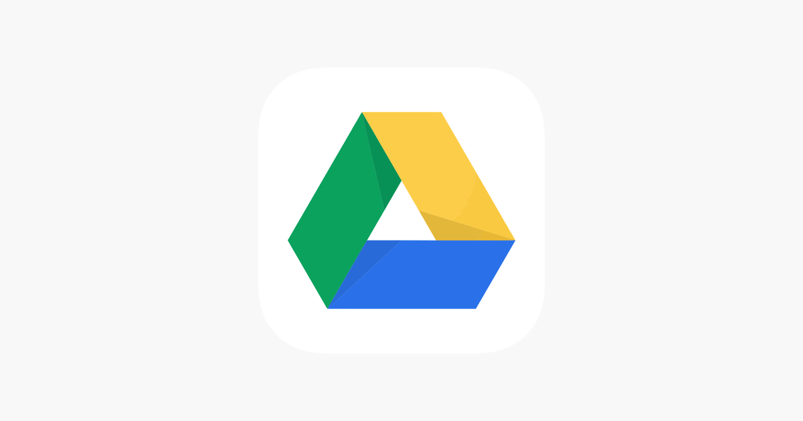

# Google Drive Walkthrough

Here is a link to the <a href='https://drive.google.com/drive/folders/1tWAg1tEks6IS2iB9W0lfBkJ2NOJIhkJF?usp=sharing'>drive folder</a>.

- *X_color.pickle*
    A pickle file contained the X data for the color images. These are
    (50,50,3) arrays for the 50x50 images with 3 channels for rgb.
- *X_grayscale.pickle*
    A pickle file containing the X data for the grayscale images. These are
    (50,50) arrays for the 50x50 images for 1 channel for grayscale.
- *y_color.pickle*
    A pickle file containing the y data for the color images. These are the
    target labels for the color images.
- *y_grayscale.pickle*
    A pickle file containing the y data for the grayscale data. These are the
    target labels for the grayscale images.
