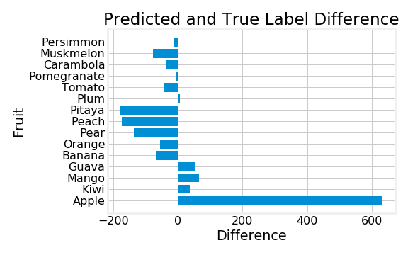

# Fruit Image Recognition


# Table of Contents
1. [Business Problem](#BP)
2. [Data](#Data)
3. [Walkthrough](#WT)
4. [Approach](#Approach)
5. [Current Conclusion](#CC)
6. [Quick Visualization](#QV)
7. [EDA of Results](#EDA)
8. [Next Steps](#NS)

---

## Problem <a name='BP'></a>
*I want to create a foundation for a food image recognition system to help generate tags for
food donation and food sharing apps.*


I took a look at some food sharing and food donation apps. Here, users can find information
for food that is up for donation or upload information for food to donate. 
While these apps did have an option to upload photos of each food item,
I noticed that users had to manually input a lot of the information themselves.
I felt that apps like these could benefit from a food image recognition system.
A food image recognition system would help take some of the work away from the
user when inputing information, as well as help generate
tags that could help search results be more accurate. The tags would
also help with keeping data organized and save some work from the
individuals that maintain the app and database. On top of that, the
database and model could keep improving from user feedback as the
database grows from user given images. To start a foundation for this, I will
start with a database of 15 different kinds of fruit. I will create a classification
model using neural networks to try to correctly predict as many fruits as possible.

---

## Data <a name='Data'></a>
I obtained the images for my 15 fruits from 
<a href=https://www.kaggle.com/chrisfilo/fruit-recognition >Kaggle</a>. 
This database consists of 44,406 images of 15 different kinds of fruit. The
resolutions of each of these pictures is 320x258 pixels that were taken with
an HD webcam. The images are also taken in an RGB color-space with 8 bits per channel.
The images included have a variety of different lighting, positioning,
and quantity arrangements that are supposed to simulate some of the conditions
one might take pictures of fruit in. Some of the fruit included can also be split
into different subcategories, such as apples having some of the following
subcategories: red apples, green apples, and yellow apples. There does not seem
to be a huge discretion in terms of the conditions the food should be collected in.


---

## Walkthrough <a name='WT'></a>
There are a few key files and folders within this repo.
- [*environment.yml*](https://github.com/cmluna2913/FruitImageRecognition/blob/master/environment.yml)
      This file will provide information on the environment I used to create my
      models and their results. Use this to re-create the environment used. Use
      the notebooks and py file as steps to re-create the given results.
      
    In order create this environment, navigate to the root directory of this
    repo and run this line in your terminal.
      
    ```python
    conda env create -n FruitRec environment.yml
    ```
    Then use
    ```python
    activate FruitRec
    ```
    to activate the environment.

- [*Model_Building.ipynb*](https://github.com/cmluna2913/FruitImageRecognition/blob/master/Model_Building.ipynb)
      
      The notebook where I create my data, transform it, and run several models.
      There are 10 models within this notebook that give insight as to how I
      proceeded with creating layers for my neural networks. I also take a look
      at some of the classification metrics that helped me decide the next steps
      to take and why I chose the model that I did.
      
- [*EDA_and_Visualizations.ipynb*](https://github.com/cmluna2913/FruitImageRecognition/blob/master/EDA_and_Visualizations.ipynb)
      
      In this notebook I quickly explore the classifications that I am looking
      at. I also take a look into the predictions my best model makes. I breakdown
      the first and last layer of my CNN model to visualize how it is working.
      
- [*data_creation.py*](https://github.com/cmluna2913/FruitImageRecognition/blob/master/data_creation.py)
      
      The backbone of my project. This file contains all the necessary functions
      that allow me to import images in either a grayscale or rgb format. There
      are also functions that package my data into pickle files or retreive the
      information from these pickle files.
      
- [*Models*](https://github.com/cmluna2913/FruitImageRecognition/blob/master/Models)
      
      This is a folder containing the necessary files for model importing. Each
      model is saved between 2 files. One is a .json file that saves the architecture
      of the model. The other file is a .h5 which saves the weights for the given
      model. They are all numbered to correspond with their respective model,
      and some steps on importing these models is in EDA_and_Visualizations.ipynb.
      
- [*Images*](https://github.com/cmluna2913/FruitImageRecognition/blob/master/Images)
      
      A folder of images I saved and used.
      
- [*Fruit_Classifications.pdf*](https://github.com/cmluna2913/FruitImageRecognition/blob/master/Fruit_Classifications.pdf)
      
      A pdf of the powerpoint presentation I made for this project.
      
- [*GoogleDrive.md*](https://github.com/cmluna2913/FruitImageRecognition/blob/master/GoogleDrive.md)
      
      A markdown file containing a walkthrough of files I uploaded on a google drive.
      This drive contains the .pickle files I created since some of them were too
      large to upload onto github.

---

## Approach <a name='Approach'></a>
I will be creating models using neural networks. As I input my information, I 
will be updating layers to try to improve my model's performance. My goal is to
get as many predictions correctly as possible, so I will be trying to improve
precision as a priority over other metrics. Precision for each class 
is the number of correct predictions over the total number of predictions. For 
example, I will be looking to improve the correct predictions of apples for all
the apple predictions I make. 

Before I begin inputing data, I chose to downscale my images to a 50x50 resolution.
I chose to do this since lowering images to this resolution still keeps the key
features of each fruit while reducing the amount of information I need to input.
This will save on time and cost as I input my images through models while still
having a good precision in prediction.

First I will input grayscale data to see how it performs. Since color is a big factor,
I will work with color images next to help with performance. I will include a comparison 
between models that use grayscale images and models that use color images.

I chose to focus on precision since the end goal is to increase the total number
of correct predictions to decrease user input. False positives and false negatives
will have the same repercussions. They are each a wrong prediction for an image
where users will only have to edit tags before posting their potential donation.
Other metrics, such as recall and f1-score, will still help in the improvement 
of the models.

---

## Current Conclusion <a name='CC'></a>
The current model that has the the best overall precision for each classification is 
the 8th model in the Model_Building.ipynb notebook. 
```python
model_8 = Sequential([Conv2D(85, kernel_size=(1), activation='relu'),
                      Flatten(input_shape=(50,50)),
                      Dropout(0.2),
                      Dense(15, activation='softmax')])
```


This model has a weighted precision of 96.33%. My model does well in predicting
most of the fruits, with the exception of a few specific fruits. For example,
apples and muskmelons have a relatively low precision compared to the
other fruits. This could be because under specific lighting and positiong conditions,
they potentially appear to have the same color. Apples and muskmelons appear very similar
to one another when muskmelons aren't fully grown, 
especially when apples are of a similar color. Further investigation
and experimentation will have to be implemented to help my model distinguish
between these fruits.


*Can you figure out which one is the muskmelon and which one is the apple?*


---

## Quick Visualization <a name='QV'></a>
My model takes a 50x50 pixel image and transforms it into an array with 3 channels
for rgb. I will use and orange as an example.


My convolutional layer breaks it down into 85 components since it consists of
85 neurons. Each neuron is able to pick up on certain components of the picture.
For example, it can pick up on certain parts of my orange. However, it might
not pick up on certain features or it even notices certain parts of the background.
For instance, it tends to notice the shine from the metal tray in some of the neurons.


Then this data is passed through a flattening layer so that I can pass it through
my final layer. The dropout layer helps with preventing my model from overfitting. In general, the dropout layer
drops a certain percentage of features randomly. This is so my model does not rely
on specific features too much when predicting fruit.

My final layer uses a 'softmax' activation function which calculates probabilites
of what class the information may fall under. It then outputs a number as to which class
it most likely is. In this case, it returns a number from 0 to 14, all of which represent one of the
the 15 classes of fruit in the data. In my orange example, it returns the number
7 which corresponds to the classification of 'Orange'.


---

## EDA of Results <a name='EDA'></a>
I am taking a look at the differences in the number of predictions for each label.
Here, I am saying that if the bar was at 0, I would have all correct predictions for
that specific label. A negative value indicates that the model predicted that number less
than actual labels. A positive value indicates that the model predicted that number more
than actual labels. For example, the model predicts 600 more apples.



I am going to look at the incorrect predictions for each class. Then I'm going
to convert those quantities as percentages. The top row is the actual label.
The left column is the predicted, incorrect label. Each value is the percent value for each
incorrect label. For example, the first value will show that
muskmelons take up about 28.37% of incorrect predictions for apples. Taking a look
at this can potentially help give me insight as to what areas my model needs improvement
on when revisiting this problem.


---

## Next Steps <a name='NS'></a>
There are a few objectives I can work towards next. 

The first would be to split the fruit into their subcategories. 
This could possibly help with with some of the
classifications. For example apples come in a variety of different colors where
I can split it into the subcategories of red, green, and yellow. Doing this
for the other fruit could potentially help classification in general. This would
work towards creating classifications for different brands/varieties
of the same fruit.

I will still work towards model improvement. This means experimenting with
more advanced layers, activation functions, and transformations that I believe
would help the models performance. Since relu is the activation function that
made a significant difference, I can test out other relu based algorithms
to see if they have any improvement.

Finally, I can work on incorporating other images/foods into the model. The
functions I created should allow for a relatively easy way of importing more
images into the datasets. I can start working on other foods that aren't
fruit and expand the classifications that my model provides.