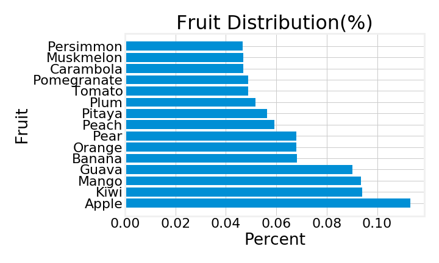
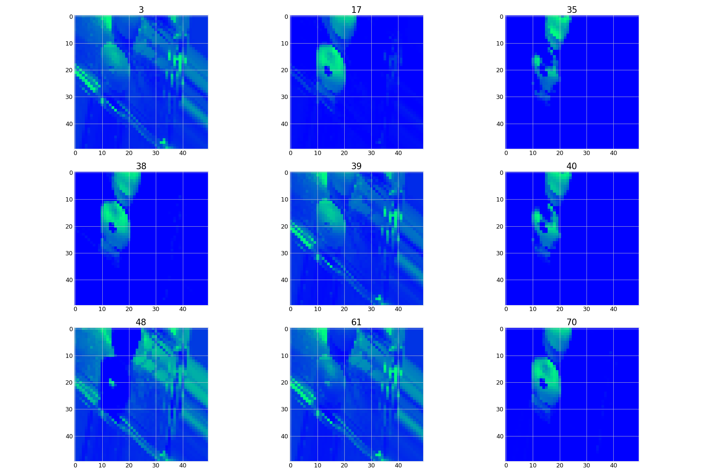

# Fruit Image Recognition


## Problem
*I want to create a food image recognition system to help generate tags for
food donation and food sharing apps.*


I took a look at some food sharing and donation apps where users can find information
about food that is up for donation or upload information of food they have
to donate. While these apps did have an option to upload photos of each food item,
I noticed that users had to manually input a lot of the information themselves.
I felt that apps like this could benefit from a food image recognition system.
A food image recognition system would help take some of the work away from the
user when inputing information, as well as help generate
tags that could help search results be more accurate. On top of that, the
database and model would keep improving from user feedback as the
database grows from user given images. To start a foundation for this, I will
start with a database of 15 different kinds of fruit. I will create a classification
model using neural networks to try to correctly predict as many fruits as possible.

## Data
I obtained the images for my 15 fruits from 
<a href=https://www.kaggle.com/chrisfilo/fruit-recognition >Kaggle</a>. 
This database consists of 44,406 images of 15 different kinds of fruit. The
resolutions of each of these pictures is 320x258 pixels that were taken with
an HD webcam. The images are also taken in an RGB color-space with 8 bits per channel.
The images included have a variety of different lighting, positioning,
and quantity arrangements that are supposed to simulate some of the conditions
one might take pictures of fruit in. Some of the fruit included can also be split
into different subcategories, such as apples having some of the following
subcategories: red apples, green apples, and yellow apples. There does not seem
to be a huge discretion in terms of the conditions of the food collected.



## Walkthrough
There are 3 key files within this repo.
* *Model_Building.ipynb*
      The notebook where I create my data, transform it, and run several models.
      There are 10 models within this notebook that give insight as to how I
      proceeded with creating layers for my neural networks. I also take a look
      at some of the classification metrics that helped me decide the next steps
      to take and why I chose the model that I did.
* *EDA_and_Visualizations.ipynb*
      In this notebook I quickly explore the classifications that I am looking
      at. I also take a look into the predictions my best model makes. I breakdown
      the first and last layer of my CNN model to visualize how it is working.
* *data_creation.py*
      The backbone of my project. This file contains all the necessary functions
      that allow me to import images in either a grayscale or rgb format. There
      are also functions that package my data into pickle files as well as let
      me retrieve the information from these pickle files. The final function
      is a function that retrieves the precisions for all my models and places
      the results into a dataframe.

## Approach
I will be creating models using neural networks. As I input my information, I 
will be updating layers to try to improve my model's performance. My goal is to
get as many predictions correctly as possible, so I will be trying to improve
precision as a priority over other metrics. Precision for each class 
is the number of correct predictions over the total number of predictions. For 
example, I will be looking to improve the correct predictions of apples for all
the apple predictions I make. 

I chose to focus on precision since the end goal is to increase the total number
of correct predictions to decrease user input. False positives and false negatives
will have the same repercussions. They are each a wrong prediction for an image
where users will only have to edit tags before posting their potential donation.
Other metrics, such as recall and f1-score, will still help in the improvement 
of the models.

First I will input grayscale data to see how it performs. Since color is a big factor,
I will work with color images to help with performance. I include a comparison between models
that use grayscale images and color images.

## Current Conclusion
The current model that has the the best precision for each classification is 
the 10th model in the Model_Building.ipynb notebook. 
```python
Sequential([Conv2D(85, kernel_size=(1), activation='relu'),
            Dropout(0.2),
            Flatten(input_shape=(50,50)),
            Dense(15, activation='softmax', activity_regularizer=regularizers.l1(0.02))])
```


This model has a weighted precision of 93.83%. Our model does well in predicting
most of the fruits, with the exception of a few specific fruits. For example,
apples, bananas, and muskmelons have a relatively low precision compared to the
other fruits. This could be because under specific lighting and positiong conditions,
they potentially appear to have the same color. Bananas can mitigate this a little
due to its irregular shape. However, apples and muskmelons appear very similar
to one another when muskmelons aren't fully grown, 
especially when apples are of a similar color. Further investigation
and experimentation will have to be implemented to help our model distinguish
between these fruits.

## Quick Visualization
My model takes a 50x50 pixel image and transforms it into an array with 3 channels
for rgb. Let us take a pitaya.


Our convolutional layer breaks it down into 85 components since it consists of
85 neurons. Each neuron is able to pick up on certain pictures of our picture.
For example, it can pick up on certain parts of our pitaya. However, it might
not pick up on certain features or it even notices certain parts of our background.
For instance, it notices the shine from the metal tray.



The dropout layer helps with preventing our model from overfitting. In general, it
drops a certain percentage of features randomly so that our model may not rely
on specific features too much on predicting fruit. Then this data is passed through
a flattening layer so that I can pass it through my final layer.

My final layer uses a 'softmax' activation function which calculates probabilites
of what class the information may fall under and outputs a number as to which class
it most likely is. It returns a number from 0 to 14, all which represent
the 15 classes of fruit in the data. In our pitaya example, it returns the number
11 which corresponds to the classification of 'Pitaya'.


## EDA of Results
First I will look at the distribution of the model's inputs and then the distribution
of the model's predictions. After running my test set through my model, I seem
to have a very similar distribution for the true labels compared to the predicted.
This shows that my model is staying pretty much on track for predicting the
correct labels.


I am going to look at the incorrect predictions for each class. Then I'm going
to convert those quantities as percentages. The columns are the true label
and the indicies are the predicted label. Each value is the percent that the
predicted label is of incorrect predictions for that class. For example,
pears take up about 26.22% of incorrect predictions for apples. Taking a look
at this can help me figure out what features the model is focusing on when I return
to look at those features.


## Next Steps
There are a few objectives I can work towards next. 

The first would be to split the fruit into their subcategories. 
This could possibly help with with some of the
classifications. For example apples come in a variety of different colors where
I can split it into the subcategories of red, green, and yellow. Doing this
for the other fruit could potentially help classification in general as well as
help start working towards creating classifications for different brands/varieties
of the same fruit.

I will still work towards model improvement. This means experimenting with
more advanced layers, activation functions, and transformations that I believe
would help the models performance. Since relu is the activation function that
made a significant difference, I can test out other relu based algorithms
to see if they have any improvement.

Finally, I can work on incorporating other images/foods into the model. The
functions I created should allow for a relatively easy way of importing more
images into our datasets. I can start working on other foods that aren't
fruit and expand the classifications that my model provides.

# Notes
I decided to pickle the data I created to save time.
I had to save some of my pickled data on a 
<a href='https://drive.google.com/drive/folders/1tWAg1tEks6IS2iB9W0lfBkJ2NOJIhkJF?usp=sharing'>drive folder</a>.
Feel free to grab the pickled data from this drive folder if you don't want to
run the data creation functions. Here is a link to my
<a href='https://drive.google.com/open?id=1UhInc0PoLSJkbdqiJZKzhGiTKV3nXWLd7xq8ubXBl_4'>powerpoint</a>.